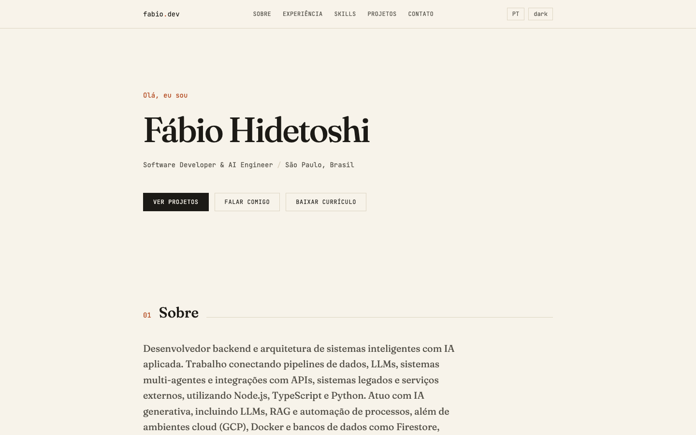
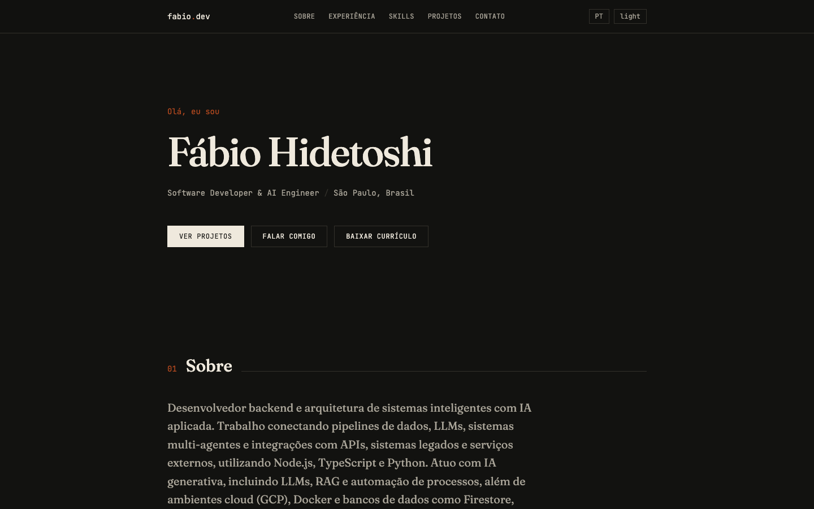
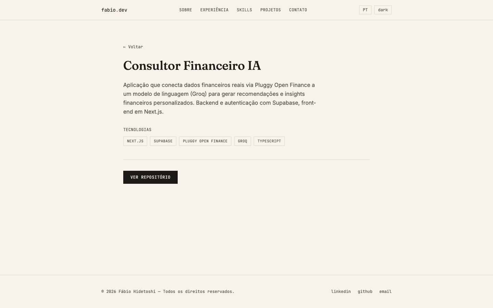
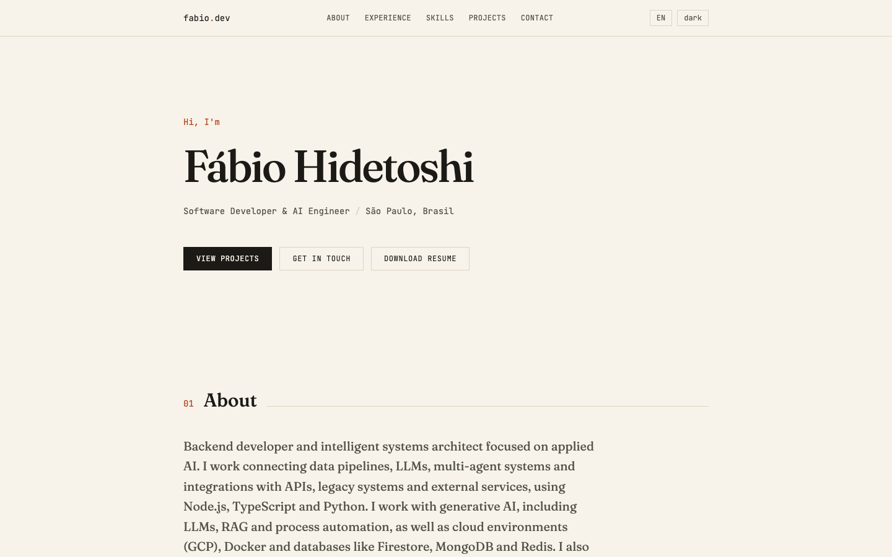
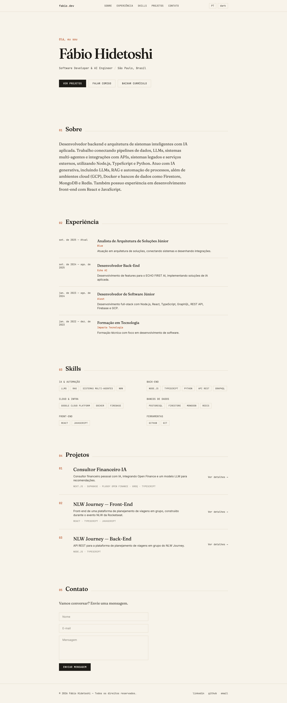

<div align="center">

# fabio.dev

### Portfólio pessoal de Fábio Hidetoshi — Software Developer & AI Engineer

[](https://react.dev)
[](https://www.typescriptlang.org)
[](https://nodejs.org)
[](https://expressjs.com)
[](https://supabase.com)
[](https://tailwindcss.com)

[LinkedIn](https://www.linkedin.com/in/fabio-hidetoshi) · [GitHub](https://github.com/fabio-hidetoshi) · [E-mail](mailto:fhaperes@gmail.com)

</div>

<br />

<p align="center">
  
  
</p>

## Sobre o projeto

Portfólio full-stack construído do zero: **React** no front-end e **Node.js/Express + PostgreSQL** no back-end. Todo o conteúdo (experiências, skills e projetos) vem de uma API própria, não está hardcoded — o site é dinâmico de verdade.

- 🌗 **Tema claro/escuro** com persistência local
- 🌐 **PT/EN** via i18next, com conteúdo bilíngue vindo do banco
- ⚙️ **API REST própria** (Express + PostgreSQL) servindo projetos, experiências e skills
- ✉️ **Formulário de contato funcional**, com validação, persistência e envio de e-mail
- 🎨 Identidade visual editorial própria — tipografia serifada + monoespaçada, sem "cara de template"

## Capturas de tela

<p align="center">
  
</p>

<details>
<summary><strong>Ver mais telas</strong> (idioma em inglês, página completa)</summary>
<br />

<p align="center">
  
</p>
<p align="center">
  
</p>

</details>

## Stack

| Camada | Tecnologias |
|---|---|
| **Front-end** | React 19, TypeScript, Vite, Tailwind CSS 4, React Router, i18next |
| **Back-end** | Node.js, Express, TypeScript, Zod, Resend |
| **Banco de dados** | PostgreSQL (Supabase) |
| **Deploy** | Vercel (front) · Render/Railway (back) |

## Estrutura

```
portfolio/
├── client/    # front-end React (Vite + TS + Tailwind)
└── server/    # API REST (Express + TS + PostgreSQL)
```

## Rodando localmente

> Este projeto é dinâmico (dados vêm de um banco Postgres), então rodar localmente exige um banco configurado — os prints acima já mostram o resultado final sem precisar rodar nada.

1. Copie os arquivos de ambiente:
   ```bash
   cp server/.env.example server/.env
   cp client/.env.example client/.env
   ```
2. Preencha `server/.env` com a `DATABASE_URL` do seu banco Postgres (Supabase/Neon).
3. Instale as dependências (na raiz do monorepo):
   ```bash
   npm install
   ```
4. Rode as migrations e o seed:
   ```bash
   npm run db:migrate
   npm run db:seed
   ```
5. Suba client e server juntos:
   ```bash
   npm run dev
   ```
   - Client: http://localhost:5173
   - Server: http://localhost:4000

## Deploy

- **Client**: Vercel (root directory `client/`, framework Vite).
- **Server**: Render ou Railway (root directory `server/`, build `npm run build`, start `npm run start`).
- **Banco**: Supabase ou Neon (Postgres gerenciado).

---

<div align="center">

Feito por [Fábio Hidetoshi](https://github.com/fabio-hidetoshi)

</div>
